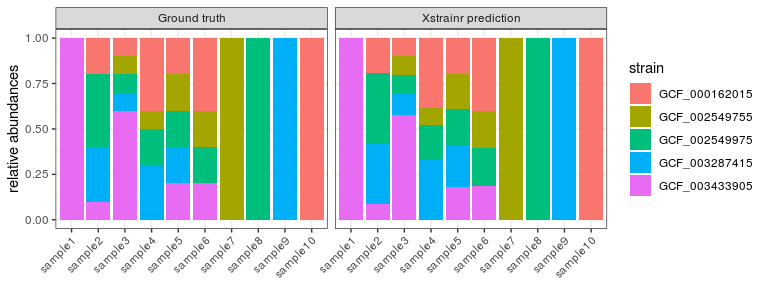

Decompose strain genomes from pangenome mapping data
================

## Load package

``` r
library(strainpandar)
```

## A demo dataset

Each row is one gene and each column is one sample:

``` r
data(fprausnitzii)
```

## Preprocessing

``` r
demo.preprocessed <- preprocess(fprausnitzii$data, pangenome.file = fprausnitzii$pangenome)
```

    ## 

## Run main program

``` r
res <- strain.decompose(demo.preprocessed)
```

    ## Intializing strain-sample matrix (S)...

    ## Selected 6 strain references.

    ## Iteration 1

    ## sum of squared delta: 0.1851

    ## Iteration 2

    ## sum of squared delta: 1.0412

    ## Iteration 3

    ## Dropping genomes due to low number of genes: 1

    ## sum of squared delta: Inf

    ## Iteration 4

    ## sum of squared delta: 0.0000

Visulaize the strain profile

``` r
## match predicted with the ground truth
ans <- fprausnitzii$ans[rank(apply(fprausnitzii$ans[,c(1,7,8,9,10)], 2, which.max)),]
ans$strain <- rownames(ans)
pred <- data.frame(res$S[rank(apply(res$S[,c(1,7,8,9,10)], 2, which.max)),])
pred$strain <- rownames(ans)

library(ggplot2)
library(dplyr)
```

    ## 
    ## Attaching package: 'dplyr'

    ## The following objects are masked from 'package:stats':
    ## 
    ##     filter, lag

    ## The following objects are masked from 'package:base':
    ## 
    ##     intersect, setdiff, setequal, union

``` r
library(reshape2)

rbind(data.frame(melt(ans), v="Ground truth"), 
      data.frame(melt(pred), v="StrainPanDA prediction")) %>% 
  ggplot(aes(x=variable, y=value, fill=strain)) + 
  geom_bar(stat="identity") +
  facet_wrap(~v) + 
  theme_bw() + 
  labs(x=NULL, y="relative abundances") + 
  theme(axis.text.x = element_text(angle=45, vjust=1,hjust=1))
```

    ## Using strain as id variables

    ## Using strain as id variables

<!-- -->

``` r
library(PRROC)
scores <- res$P_est[,rownames(pred)]
truth <- demo.preprocessed$reference[, rownames(ans)]
truth <- truth[rowSums(truth)!=0,]
merged <- merge(scores, truth, by=0, all=TRUE)
merged[is.na(merged)] <- 0


s1 <- pr.curve(weights.class0 = merged[,7], scores.class0 = merged[,2], curve = TRUE) 
s2 <- pr.curve(weights.class0 = merged[,8], scores.class0 = merged[,3], curve = TRUE) 
s3 <- pr.curve(weights.class0 = merged[,9], scores.class0 = merged[,4], curve = TRUE) 
s4 <- pr.curve(weights.class0 = merged[,10], scores.class0 = merged[,5], curve = TRUE) 
s5 <- pr.curve(weights.class0 = merged[,11], scores.class0 = merged[,6], curve = TRUE) 

rbind(
  data.frame(s1$curve, Label='Strain1'),
  data.frame(s2$curve, Label='Strain2'),
  data.frame(s3$curve, Label='Strain3'),
  data.frame(s3$curve, Label='Strain4'),
  data.frame(s3$curve, Label='Strain5')
) %>% 
  dplyr::select(Recall=X1, Precision=X2, Label) %>% 
  ggplot(aes(x=Recall, y=Precision, col=Label))+
  geom_path(lwd=1) + 
  theme_bw()
```

<!-- -->

Session information

``` r
sessionInfo()
```

    ## R version 3.6.3 (2020-02-29)
    ## Platform: x86_64-pc-linux-gnu (64-bit)
    ## Running under: Ubuntu 16.04.4 LTS
    ## 
    ## Matrix products: default
    ## BLAS:   /opt/R-3.6.3/lib/R/lib/libRblas.so
    ## LAPACK: /opt/R-3.6.3/lib/R/lib/libRlapack.so
    ## 
    ## locale:
    ##  [1] LC_CTYPE=en_IN.UTF-8       LC_NUMERIC=C              
    ##  [3] LC_TIME=en_IN.UTF-8        LC_COLLATE=en_IN.UTF-8    
    ##  [5] LC_MONETARY=en_IN.UTF-8    LC_MESSAGES=en_IN.UTF-8   
    ##  [7] LC_PAPER=en_IN.UTF-8       LC_NAME=C                 
    ##  [9] LC_ADDRESS=C               LC_TELEPHONE=C            
    ## [11] LC_MEASUREMENT=en_IN.UTF-8 LC_IDENTIFICATION=C       
    ## 
    ## attached base packages:
    ## [1] stats     graphics  grDevices utils     datasets  methods   base     
    ## 
    ## other attached packages:
    ## [1] PRROC_1.3.1    reshape2_1.4.4 dplyr_1.0.0    ggplot2_3.3.2  strainpandar_0.1.0
    ## 
    ## loaded via a namespace (and not attached):
    ##  [1] Rcpp_1.0.5       pracma_2.2.9     pillar_1.4.4     compiler_3.6.3  
    ##  [5] plyr_1.8.6       iterators_1.0.12 tools_3.6.3      digest_0.6.25   
    ##  [9] gtable_0.3.0     evaluate_0.14    lifecycle_0.2.0  tibble_3.0.2    
    ## [13] nlme_3.1-144     lattice_0.20-38  mgcv_1.8-31      pkgconfig_2.0.3 
    ## [17] rlang_0.4.6      Matrix_1.2-18    foreach_1.5.0    yaml_2.2.1      
    ## [21] parallel_3.6.3   xfun_0.15        withr_2.2.0      stringr_1.4.0   
    ## [25] knitr_1.29       cluster_2.1.0    generics_0.0.2   vctrs_0.3.1     
    ## [29] grid_3.6.3       tidyselect_1.1.0 glue_1.4.1       R6_2.4.1        
    ## [33] rmarkdown_2.3    farver_2.0.3     purrr_0.3.4      magrittr_1.5    
    ## [37] scales_1.1.1     codetools_0.2-16 ellipsis_0.3.1   htmltools_0.5.0 
    ## [41] MASS_7.3-51.5    splines_3.6.3    colorspace_1.4-1 permute_0.9-5   
    ## [45] labeling_0.3     stringi_1.4.6    munsell_0.5.0    NNLM_0.4.4      
    ## [49] crayon_1.3.4     vegan_2.5-6
