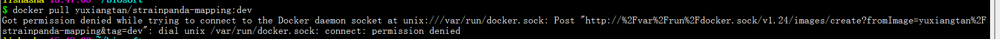
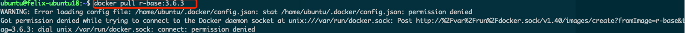
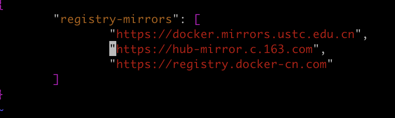
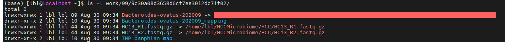

# StrainPanDA - A strain analysis pipeline based on pangenome
# 常见问题


## 无法拉取镜像


### 原因1: 没有登录docker账号


如果还没账号，需要先注册[docker hub](https://hub.docker.com/).

如果已经有账号了，需要先[登录](https://www.runoob.com/docker/docker-login-command.html)

<br>

### 原因2: 用户的docker权限没配置好


解决方法1: 使用sudo docker pull

```
sudo docker pull yuxiangtan/strainpanda-mapping:dev
sudo docker tag yuxiangtan/strainpanda-mapping:dev strainpanda-mapping:dev
```

解决方法2: 让管理员把用户添加到 docker group 里. [详见](https://docs.docker.com/engine/install/linux-postinstall/).

### 原因三：国内源太差
可以如图设置源路径，能较大程度提升下载速度。


## 跑PanPhlAN时失败

**主要原因：参考数据库的路径名称没有按照争取的规则**

检查是否路径正确，可以通过 `ls -l <the path of error log>` 去查看是否有文件的路径有问题

见例子图：


## 设置线程数量
线程参数暂时没有开放给用户使用，默认使用8个线程

感兴趣的可以根据nextflow文档自行修改conf/base.config 中cpus的[预设值](https://www.nextflow.io/docs/latest/process.html#cpus)


## 如何获取基因家族的功能注释 
对应现有的参考数据库，每个基因家族已经生成了对应的功能注释（在"anno.csv"文件里）。

实际操作时，可以把菌株的基因谱，和这些功能注释文件，通过R进行"merge"，就得到相应的注释关系了。


## 如何将自有菌株（自己试验所用的，数据库中没有的菌株）加入数据库中进行分析
可以先进行泛基因组分析，利用矩阵将自有菌株与数据库中菌株进行AJI（Average jacard index）计算比对，若AJI>=99，则重建过程中自有菌株会与数据库中现有菌株合并，因此没有必要重建。如果AJI<99，可以考虑重建。如果不重建，也可以通过比较预测菌株的基因谱和自有菌株的基因谱的AJI关系去判断那个预测菌株更接近自有菌株。
